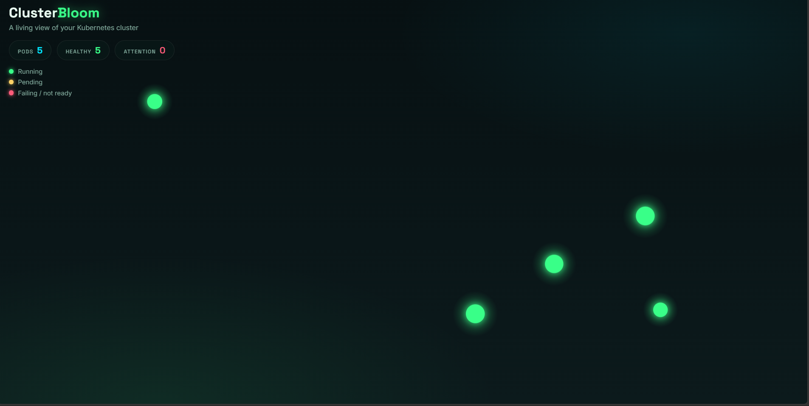
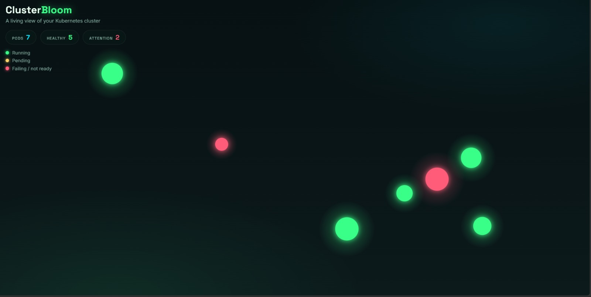
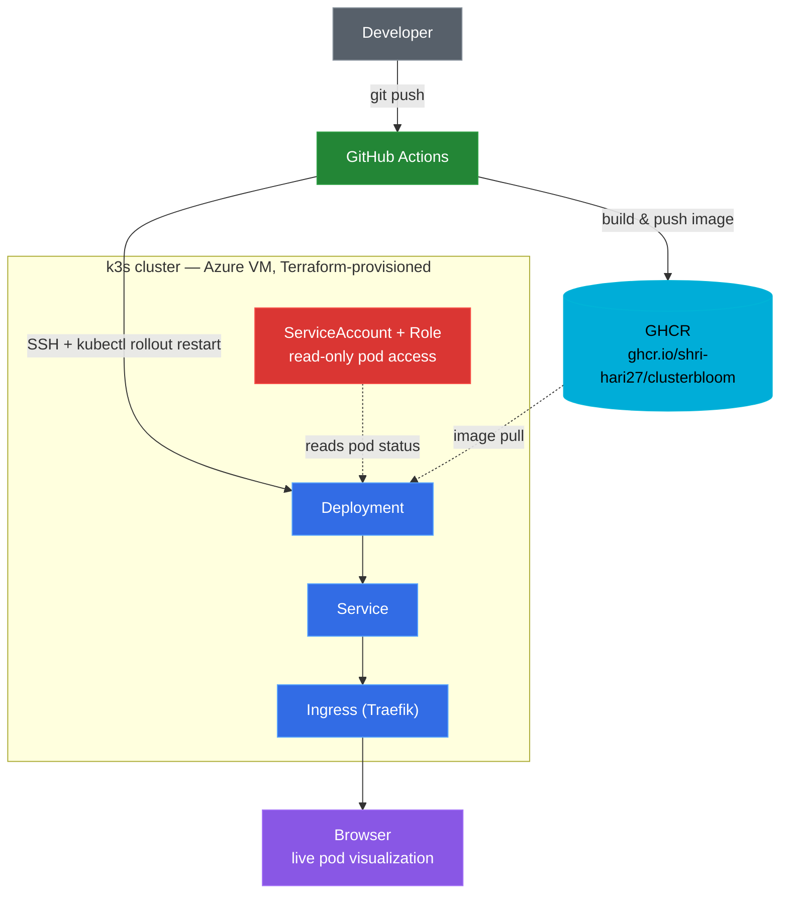

# ClusterBloom — A Living Visualization of a Kubernetes Cluster


A bioluminescent, real-time visualization of a k3s Kubernetes cluster: every
pod is rendered as a glowing organism that blooms in when it starts, pulses
based on real readiness/restart data pulled live from the Kubernetes API,
and wilts away when it's terminated. Provisioned end-to-end with
**Terraform**, running on **k3s** (lightweight Kubernetes) on an **Azure
VM**, containerized with **Docker**, and continuously deployed via
**GitHub Actions**.

**Live demo:** the cluster is torn down between sessions to control cost
(see [Cost management](#cost-management)) — spin it up with the
one-command Terraform flow to see it live.

## Contents
- [Screenshots](#screenshots)
- [What this project demonstrates](#what-this-project-demonstrates)
- [Architecture](#architecture)
- [Tech stack](#tech-stack)
- [Running this yourself](#running-this-yourself)
- [Notable troubleshooting](#notable-troubleshooting-the-real-engineering-part)
- [A known trade-off](#a-known-trade-off-ephemeral-infrastructure-vs-the-cicd-pipeline)
- [Cost management](#cost-management)

## Screenshots

<table>
<tr>
<td width="50%">

**Unhealthy pods**

Two deliberately broken pods render as coral-red blooms, pulsing faster to signal they need attention — driven entirely by real pod status from the Kubernetes API.

</td>
<td width="50%">

**Healthy cluster**

Each glowing bloom is a live pod — scaling the deployment up or down blooms new ones in or wilts them away in real time.

</td>
</tr>
</table>

## What this project demonstrates

- **Infrastructure as Code** — the VM, virtual network, subnet, NSG, and public IP are all provisioned by Terraform, not clicked together manually.
- **Kubernetes fundamentals on real infrastructure** — a Deployment, Service, and Ingress (via k3s's built-in Traefik) running on an actual VM-backed cluster, not just a local Minikube/kind sandbox.
- **Least-privilege RBAC** — the app authenticates to the Kubernetes API using a dedicated ServiceAccount scoped to a `Role` (not `ClusterRole`) that can only `get`/`list`/`watch` pods in one namespace. No write access, no cluster-wide reach. Most tutorials skip this or grant `cluster-admin`; this project deliberately doesn't.
- **CI/CD onto a live cluster** — a GitHub Actions pipeline that builds the app image, pushes it to GHCR, then SSHs into the cluster's node and triggers a rolling restart — genuine continuous deployment, not a one-time manual deploy.

## Architecture



## Tech stack

| Layer | Tool |
|---|---|
| IaC | Terraform (`azurerm` provider) |
| Compute | Azure VM (Ubuntu 22.04) |
| Orchestration | k3s (lightweight single-node Kubernetes) |
| Containerization | Docker, image hosted on GitHub Container Registry |
| CI/CD | GitHub Actions (`docker/build-push-action`, `appleboy/ssh-action`) |
| Backend | Node.js/Express, native `https` module for Kubernetes API calls |
| Frontend | HTML5 Canvas, vanilla JavaScript, CSS |
| Security | Namespace-scoped RBAC Role + ServiceAccount |

## Running this yourself

```bash
# 1. Provision the VM + k3s
cd terraform
terraform init
terraform apply
# note the vm_public_ip output

# 2. Build & push the app image
cd ../app
docker build -t ghcr.io/<your-username>/clusterbloom:latest .
docker login ghcr.io -u <your-username>
docker push ghcr.io/<your-username>/clusterbloom:latest
# make the package public via GitHub -> Packages -> clusterbloom -> Package settings

# 3. Deploy manifests onto the cluster
scp -i ~/.ssh/azure_rsa ../k8s/*.yaml <user>@<vm_ip>:~/
ssh -i ~/.ssh/azure_rsa <user>@<vm_ip>
sudo k3s kubectl apply -f rbac.yaml
sudo k3s kubectl apply -f deployment.yaml
sudo k3s kubectl apply -f service.yaml
sudo k3s kubectl apply -f ingress.yaml

# 4. Set up CI/CD
#    - Add a PAT with write:packages scope as GitHub secret GHCR_PAT
#    - Add SSH_PRIVATE_KEY, VM_HOST, VM_USER as GitHub secrets
#    - Push a change to app/ or k8s/ -- the pipeline builds, pushes, and redeploys automatically
```

Then visit `http://<vm_public_ip>`.

## Notable troubleshooting (the real engineering part)

This project surfaced a genuinely wide range of real infrastructure issues,
kept here deliberately:

- **RBAC data-plane vs. control-plane confusion** (carried over learning from the previous project) — owning/managing a resource doesn't grant data-level access to what's inside it.
- **ARM propagation races.** Subnet, vnet, and NSG creation sometimes succeeded on Azure's side but a subsequent Terraform read-back returned a stale `404`, because Azure's control plane hadn't fully propagated yet. Fixed with explicit `time_sleep` resources between dependent network resources, forcing real waits instead of relying on Terraform's default (too-fast) dependency resolution.
- **Resource-group name caching.** Deleting and recreating a resource group with the *same name* repeatedly in a short window caused persistent, inconsistent "not found" errors — traced to stale ARM metadata tied to the reused name. Fixed by using a fresh, never-before-used resource group name.
- **Multi-region VM SKU capacity.** `Standard_B1s` (the free-tier-eligible size) hit `SkuNotAvailable` capacity restrictions in five separate regions in a row. Resolved by checking live availability with `az vm list-skus` and ultimately switching to a slightly larger, more consistently available size (`Standard_D2s_v3`) — a deliberate cost/availability trade-off, not a free workaround.
- **WSL/Windows Azure CLI interop bug.** An old Windows-installed `az` CLI accessed through WSL interop caused multiple opaque failures (malformed HTML error responses instead of proper JSON). Fixed by installing the native Linux Azure CLI directly inside WSL.
- **Node.js 18 `fetch` + custom CA incompatibility.** The app worked fine locally (using mock data), but failed silently once deployed to the real cluster: Node's built-in `fetch` doesn't reliably support the `agent` option needed for custom CA certificates when calling the in-cluster Kubernetes API over HTTPS. Fixed by using Node's native `https` module directly for that one call instead.
- **GHCR package permissions for GitHub Actions.** The default `GITHUB_TOKEN` lacked write access to a package that had been created via a personal manual push. Resolved by authenticating the pipeline with a dedicated Personal Access Token scoped to `write:packages`.

## A known trade-off: ephemeral infrastructure vs. the CI/CD pipeline

To avoid unnecessary cost, the VM is destroyed (`terraform destroy`) between
work sessions rather than left running. This means:

- The VM's public IP changes every time it's re-provisioned
- The `VM_HOST` GitHub secret needs updating after each fresh `terraform apply`
- Kubernetes manifests need a one-time re-apply on a freshly provisioned VM before the CI/CD pipeline's `rollout restart` step has anything to restart

This is a deliberate, understood trade-off between minimizing cost for a
portfolio project and running an always-on production-style pipeline — not
an oversight.

## Cost management

```bash
cd terraform
terraform destroy
```

**Note:** unlike the static-site project, this one uses a VM
(`Standard_D2s_v3`, ~$0.10/hour), which bills for uptime regardless of
activity — always destroy when not actively demoing or working on it.

## Author

Built by [shri-hari27](https://github.com/shri-hari27) as a DevOps
portfolio project demonstrating Terraform, Kubernetes/k3s, Docker, RBAC
security design, and CI/CD pipeline construction.
